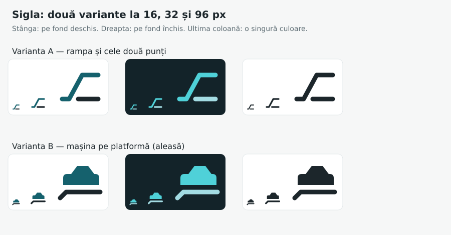
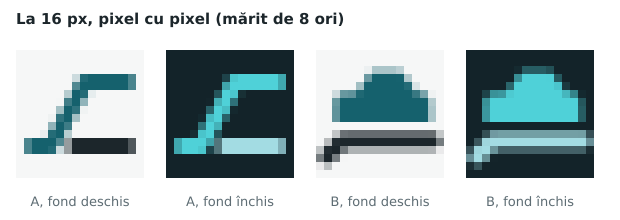

# Sigla

Numele platformei este în `src/config/brand.ts` și nicăieri altundeva.
Sigla nu conține nicio literă, deci nu se schimbă odată cu numele.

## Cele două variante



- **Varianta A: rampa și cele două punți.** Două linii: una urcă pe rampă
  și continuă pe puntea de sus, cealaltă este puntea de jos. A fost sigla
  din 25 septembrie, până la alegerea numelui.
- **Varianta B: mașina pe platformă (aleasă).** O mașină, desenată plin
  (caroserie și cabină, fără roți, pentru că stă pe ceva), pe puntea unui
  transportor. Puntea coboară în spate, în rampa de încărcare.

## De ce B

La 16 px, cât are favicon-ul în fila browserului, o formă plină rezistă
grilei de pixeli, iar o linie oblică subțire se transformă într-o scară de
pixeli pe jumătate colorați. Varianta A citește acolo ca „o treaptă"; B
citește ca „o mașină pe ceva", adică exact ce face platforma.



B merge și într-o singură culoare. Între mașină și platformă rămâne loc
liber, deci cele două nu se lipesc nici la 16 px.

## Originalitate

Sigla este desenată de la zero din forme simple: un trapez peste un
dreptunghi rotunjit și o linie frântă. Nu este derivată din sigla altei
firme și nu imită nicio siglă existentă. Nu am putut compara cu toate
mărcile înregistrate. Înainte de înregistrarea mărcii, o căutare la OSIM și
EUIPO pentru nume și siglă este pasul corect.

## Cum se regenerează tot

```bash
pnpm brand
```

Comanda redesenează favicon-ul (SVG și 32 px), iconița de iOS (180 px),
iconițele aplicației (192 și 512, plus variantele maskable), sigla din
e-mailuri și imaginea pentru distribuire (1200×630, cu numele). Tot ea
scrie și copia numelui și a siglei pentru funcțiile edge. Se rulează după
orice schimbare de nume, de siglă sau de culoare, iar rezultatul se
comite. `tests/unit/brand.test.ts` pică dacă vreunul dintre fișiere este
mai vechi decât sursa lui.

Geometria siglei este în `src/config/brand-mark.ts`, componentele în
`src/components/brand/`.
